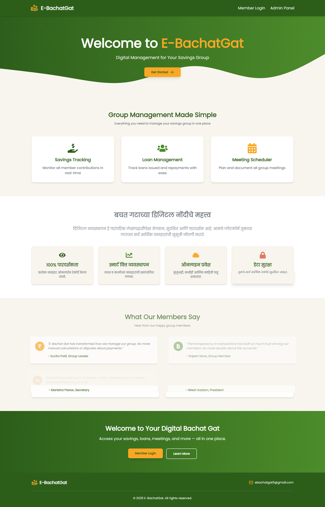

# eBachatGat – Turning Handwritten Records into a Smart Digital Platform💡

>

## 🌟 Overview
eBachat Gat is a full-stack platform that digitizes traditional Indian savings groups (Bachat Gats), enabling secure management of collective savings, loans, and meetings. The system modernizes these community banking systems while preserving their core social and financial principles.

## 🚀 Key Features

### 🔐 Role-Based Access Control
| Role        | Key Responsibilities                          |
|-------------|-----------------------------------------------|
| Admin       | User management, system configuration         |
| Treasurer   | Financial tracking, report generation        |
| President   | Loan approval/denial decisions               |
| Secretary   | Meeting scheduling and management            |
| Member      | Contributions, loans, document submission    |

### 💰 Financial Management
- Real-time savings tracking per member/group
- Loan request workflow with dual approval system
- Automated interest calculations
- Razorpay integration for digital payments (test mode)

### 📅 Meeting Management
- Interactive calendar interface (FullCalendar)
- Automated meeting reminders
- Attendance tracking

### 📄 Document Handling
- Secure document uploads (KYC, guarantor agreements)
- PDF report generation for financial statements
- Cloudinary integration for media storage

## 🛠 Tech Stack

### Frontend
- **Framework**: React 18
- **Styling**: Tailwind CSS + DaisyUI
- **State Management**: React Context API
- **UI Components**: HeadlessUI, React Icons
- **Calendar**: FullCalendar

### Backend
- **Runtime**: Node.js 18+
- **Framework**: Express.js
- **Authentication**: JWT (Cookie-based)
- **PDF Generation**: PDFKit
- **Payments**: Razorpay API

### Database
- **Primary DB**: MongoDB Atlas
- **ODM**: Mongoose

### DevOps
- **Environment Variables**: dotenv
- **Version Control**: Git

## 🏁 Getting Started

### Prerequisites
- Node.js 18+
- MongoDB Atlas account or local MongoDB 6.0+
- Cloudinary account (for document storage)
- Razorpay test credentials

